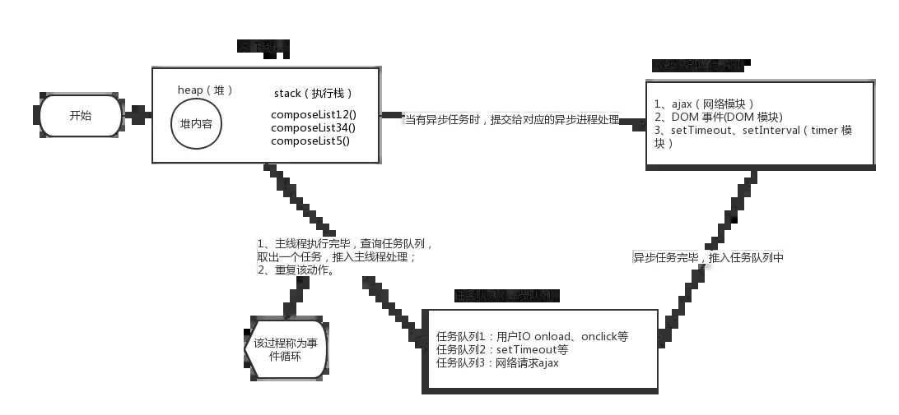

### js的运行机制  

#### js是一门单线程语言
> 单线程是指Js引擎执行Js时只分了一个线程给他执行，也就是执行js时是单线程的，同一时间做一件事情。  

#### 运行环境
> 一般在node或者浏览器下。  


#### 任务队列
> 所有任务可以分成两种，一种是同步任务，另一种是异步任务。  
> 
> 同步任务：在主线程上排队并按顺序执行的任务。形成一个执行栈。   
> 
> 异步任务：首先不进入主线程，提交给对应的异步进程处理，待处理完毕后，就会将其回调（如果有）推送到任务队列中。当主线程的同步任务执行完毕后，
> 系统就会读取任务队列，将任务队列的首个任务推到主线程的执行栈中执行。


### 事件循环机制



处理主线程的整体代码，然后检查是否存在 Microtasks 并将其清空，最后更新 render。

在事件循环中，每进行一次循环操作称为 tick：
> 选择最先进入任务队列的任务，将其推入主线程并执行，检查是否存在 Microtasks 并将其清空，更新 render。

### 宏任务与微任务

macrotask
> 每次执行栈执行的代码就是一个宏任务（包括每次从事件队列中获取**一个**事件回调并放到执行栈中执行）。

宏任务包括
:-
script(整体代码)、 setTimeout、 setInterval I/O、 UI交互事件 、postMessage、 MessageChannel、 setImmediate(Node.js 环境)

microtask
> 在当前宏任务执行结束后立即执行的任务。  

微任务包括
:-
Promise.then、Object.observe、MutaionObserver、process.nextTick(Node.js 环境)

### 简单的宏任务与微任务执行顺序
```
console.log('begin')

setTimeout(() => {  
    console.log('setTimeout')
}, 0);

Promise.resolve().then(() => {
    console.log('promise');
});

console.log('end');
```
:herb: 推测如果在宏任务和微任务中有渲染相关的代码，会将其储存并在最后处理。


task queue：任务队列  
Event Loop：事件循环机制  
macrotask： 宏任务  
microtask：微任务  
