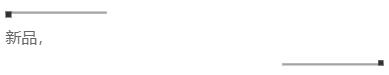
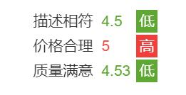
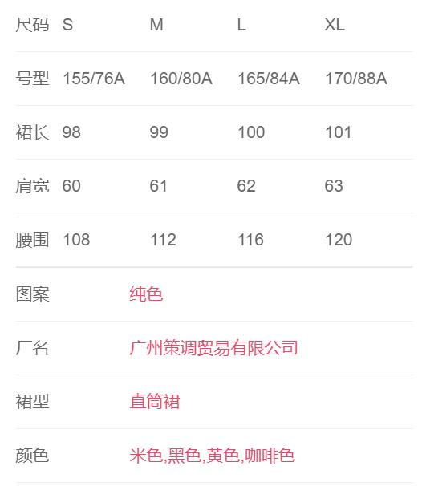

- 布局相关  
  + [未知数量元素的多行规律排列](#未知数量元素的多行规律排列)   
  + 弹性布局  
    - [已知数量元素的多行规律排列](#已知数量元素的多行规律排列)  
    - [未知数量元素的单行均匀排列](#未知数量元素的单行均匀排列)  
    - [单行中某元素占据剩余宽度](#单行中某元素占据剩余宽度)  
    - [单行中两端对齐](#单行中两端对齐)  
    - [单行中两元素固定占比](#单行中两元素固定占比)  
    - [使项目在容器的中间对齐](#使项目在容器的中间对齐)  
    - [为justify-content配置兼容的space-evenly](#为justify-content配置兼容的space-evenly)   
  + [line-hight](#line-hight)  
  + [table](#table)  
  + [采用居中布局的选项](#采用居中布局的选项)  
  + [设置固定顶部的导航栏](#设置固定顶部的导航栏)   
- 图片相关    
  + [消除图片下默认的3px](#消除图片下默认的3px)  
  + [在不具体宽度下，设置图片的长宽比](#在不具体宽度下，设置图片的长宽比)  
  + [给图像添加圆形效果](#给图像添加圆形效果)  
- 其它  
  + [拟造箭头](#拟造箭头)  
  + [给文字设置省略效果](#给文字设置省略效果)  
  + [简单的自设计装饰效果](#简单的自设计装饰效果)  
  + [去除列表的默认缩进](#去除列表的默认缩进)  


#### 未知数量元素的多行规律排列    
> 当元素需要多行规律排列，且最后一行的元素数量不确定时，使用 [Grid](https://github.com/SpringLoach/origin-2021/blob/happy-day/css/样式速查表.md#网格属性) 布局可以轻松实现该效果。  

```
.container {
  display: grid;
  grid-template-columns: 25% 25% 25%;
  justify-content: space-evenly;
  grid-row-gap: 10px;
  text-align: center;
  margin-bottom: 20px;
}
.container .item img {
  width: 100%; 
}
```

#### 已知数量元素的多行规律排列  
> 每一行的元素数量都是确定的。  

```
.container {
  display: flex;
  flex-wrap: wrap;
  justify-content: space-around;  // space-evently 可以达到间隙均等效果，有兼容性问题
  padding: 3px;
}
.container .item {
  width: 48%;
}
```

#### 未知数量元素的单行均匀排列  

```
.father { display: flex; }
.father .all-son { flex: 1; }
```

#### 单行中某元素占据剩余宽度    

```
.father { display: flex; }
.father .specil-son { flex: 1; }
```

#### 单行中两端对齐   

```
.father {
  display: flex;
  justify-content: space-between;
}
```

#### 单行中两元素固定占比  
```
.container { display: flex; }
.container .left { width: 25%; }
.container .right { width: 75%; }
```


#### 使项目在容器的中间对齐  

```
.father { 
  display: flex; 
  align-items: center;
  justify-content: center;
}
```

#### 为justify-content配置兼容的space-evenly

```
.container {
  display: flex;
  justify-content: space-between;
}
.container::after, .container::before {
  content: '';
  display: block;
}
```

#### 消除图片下默认的3px  
> 似乎也能对行内元素起作用。  

```
.any img { vertical-align: middle; }
```  

#### 在不具体宽度下，设置图片的长宽比  

```
.picbox {
  position: relative;
}
.picbox::before {
  content: "";
  display: block;
  padding-top: 150%; // 调长宽比
}
.picbox img {
  width: 100%;
  height: 100%;
  position: absolute;
  top: 0;
  left: 0;
}
```

#### 设置固定顶部的导航栏  

```
position: fixed;
left: 0;  
right: 0;  // 占据全宽
top: 0;
```

#### line-hight  
> 可以设置高等与行高来实现元素的垂直水平，但需要注意行高的继承性，会对子元素的垂直布局产生影响。感觉完全可以用 flex 布局替代吧。    

#### 拟造箭头  

```
.arrow {
  font-family: serif;
  font-weight: 900;
}
```

#### 给图像添加圆形效果

```
.info-left img{
  border-radius: 50%;
  padding: 10px;  // 控制图像与边界的距离  
}
```

#### 给文字设置省略效果  

```
/* 要有一个宽度 */
.info p {
  white-space: nowrap; 
  overflow: hidden;
  text-overflow: ellipsis;
}
```

#### 采用居中布局的选项

```
.where {
  text-align: center;
}
.where .option {
  display: inline-block;
  background-color: #f2f5f8;  // 视觉效果
  padding: 5px 30px;
  border-radius: 10px;
}
```

#### 简单的自设计装饰效果  



```
<div class="info-desc clearfix">
  <div class="start"></div>
  <p>some text..</p>
  <div class="end"></div>
</div>

.info-desc .start, .info-desc .end {
    width: 25vw;
    height: 2px;
    background-color: #a3a3a5;
    position: relative;
}
.info-desc .start {
    float: left;
}
.info-desc .end {
    float: right;
}
.info-desc .start::before,.info-desc .end::after {
    content: "";
    background-color: #333;
    height: 5px;
    width: 5px;
    position: absolute;
}
.info-desc .end::after {
    right: 0;
    bottom: 0;
}
.clearfix::after {
  content: "";
  clear: both;
  display: table;
}
```

#### table  



```
.box {text-align: center;}
.box table {
    display: inline-block;
    text-align: start;
}
```



```
.table-box {
  padding: 10px 15px 0;
  font-size: 14px;
  border-bottom: 5px solid #f2f5f8;
}
.table-box table {
  width: 100%;           // 使表格占据全部宽   
  border-collapse: collapse;
}
.table-box table tr td {
  padding: 14px 0;
  border-bottom: 1px solid rgba(100,100,100,.1);
}
table .first-td {
  /* 当 value 的数据量比较大的时候, 会挤到 key ，所以给一个固定的宽度，视觉上也更美观 */
  width: 95px;
}
```

#### 去除列表的默认缩进  

```
*{box-sizing: border-box; margin: 0; padding: 0;}
```

