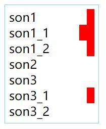
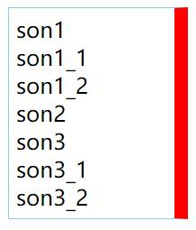
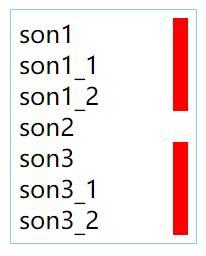

- css
  + [css_变量](#css_变量)    
- [less](#less)  
  + [less_变量](#less_变量)  
  + [less_嵌套](#less_嵌套)  
  + [less_嵌套2](#less_嵌套2)  
- [sass](#sass)  
  + [sass_变量](#sass_变量)    
  + [sass_嵌套](#sass_嵌套)   
  + [sass_父选择器的标识符&](#sass_父选择器的标识符&)  
  + [sass_嵌套属性](#sass_嵌套属性)  
  + [sass_导入文件](#sass_导入文件)  
  + [sass_静默注释](#sass_静默注释)  
  + [sass_混合器](#sass_混合器)  
  + [sass_混合器2](sass_混合器2)  
  + [sass_给混合器传参](sass_给混合器传参)  
  + [sass_选择器继承](sass_选择器继承)   
  + [sass_选择器继承_复杂继承](sass_选择器继承_复杂继承)  
- [sass补充](#sass补充) 


#### css_变量 

```
:root {
  /* 主题颜色 */
  --themeColor: #eb4450;
}

/* 直接使用 */
.div1 {
  color: var(--themeColor);
  background-color: currentColor;
}

/* 局部更改，使用 */
.div2 {
  --themeColor: skyblue;
  color: var(--themeColor);
}
```

### less  

#### less_变量  

```
@themeColor: #eb4450;

.div1 {
  color: @themeColor;  
}

.div2 {
  @themeColor: skyblue;  
  color: @themeColor; 
}
```

#### less_嵌套

```
.contain {
  color: red;
  .son1 {
    background-color: blue;
  }
  .son2 {
    background-color: yellow;
  }
}
```

#### less_嵌套2

```
<view class="contain">
  <view class="son1">son1
    <view class="son1_1">son1_1</view>
    <view class="son1_2">son1_2</view>    
  </view>
  <text>son2</text>
  <view class="son3">son3
    <view class="son3_1">son3_1</view>
    <view class="son3_2">son3_2</view> 
  </view>
</view>
```



```
/* 
  & 相当于父选择器的标识符 .contain
  这里选择 .contain 及其所有后代中的第一个元素
*/
.contain {
  & :nth-child(1) {
    border-right: 10px solid red;
  } 
}
```



```
// 这里找到所有环境中的第一个子元素，如果该元素为 .contain，则添加样式
.contain {
  &:nth-child(1) {
    border-right: 10px solid red;
  } 
}
```



```
// 这里找到 .contain 下类型为 view 的子元素
.contain {
  & > view {
    border-right: 10px solid red;
  }  
}
```

----

### sass

#### sass_变量  

索引 | 说明
:-: | :-
① | 在声明变量时，变量值也可以引用其他变量  
② | 变量中使用 `-` 和 `_` 是一样的，但这不适合于选择器，如类名  

```
$themeColor: #eb4450;  
$theme-Border: 1px solid $themeColor;

.div1 {
  color: $themeColor;  
}

.div2 {
  $themeColor: skyblue;  
  color: @themeColor; 
}

.div3 {
  border: $theme_Border
}
```

#### sass_嵌套  
> 与 [less](#less_嵌套) 一致。  

#### sass_父选择器的标识符&  
> 用于代替父选择器，在使用父类的伪类和伪元素时，需要用上。  

#### sass_嵌套属性  

```
nav {
  border: 1px solid #ccc {
  left: 0px;
  right: 0px;
  }
}

// 等价于  
nav {
  border: 1px solid #ccc;
  border-left: 0px;
  border-right: 0px;
}

// 命名空间不一定要有属性值  
.funky {
  font: {
    family: fantasy;
    size: 30em;
    weight: bold;
  }
}
```

#### sass_导入文件  

索引 | 概况 | 说明
:-: | :- | :-
① | 智能匹配 | 导入的文件名可以不加后缀  
② | 导入使用 | 被导入文件中的变量和混合器，可以在导入文件使用  
③ | 局部文件 | 不想被单独打包为独立 `css` 的文件，以 `_` 开头命名即可 
③ | 局部文件 | 导入时可以省略 `_`  
④ | 默认变量值 | 别人导入局部文件前，声明了该变量，则局部的变量声明无效
⑤ | 选择器局部导入 | 可以在选择器内局部导入文件，以局部使用  
⑥ | 原生css导入 | 直接导入时，会造成额外下载，如后缀 `.css`
⑥ | 原生css导入 | 由于语法完全兼容，将后缀改为 `.scss` 即可

```
/* 自动补全为下面的其中一个 */
@import "sidebar"

@import "sidebar.sass"

@import "sidebar.scss"
```

默认变量值  
```
// 如果用户导入该局部文件前，声明了该变量，使用用户的赋值  

$fancybox-width: 400px !default;
.fancybox {
  width: $fancybox-width;
}
```

选择器局部导入文件   
```
.div1 {@import "blue-theme"}
```

#### sass_静默注释    

索引 | 出现在生成的css文件中 | 格式
:-: | :-: | :-
① | 不会 | // abc
② | 会 | /\* abc \*/
③ | 不会 | 属性值中的 ②

#### sass_混合器  
> 对于大段需要重复使用的样式代码，使用混合器会很舒服。  

索引 | 说明 | 格式
:-: | :-: | :-
① | 导出 | @mixin 命名
② | 导入 | @include 名字

```
@mixin rounded-corners {
  -moz-border-radius: 5px;
  -webkit-border-radius: 5px;
  border-radius: 5px;
}

notice {
  background-color: green;
  border: 2px solid #00aa00;
  @include rounded-corners;
}
```


何时适合  
这段样式本身就是一个逻辑单元，比如说是一组放在一起有意义的属性。能为这个混合器想出一个好的名字。展示性的，描述了最终的视觉样式

/语义化的类

#### sass_混合器2  
> 混合器中还包含css规则，包含选择器和选择器中的属性。  

```
@mixin no-bullets {
  list-style: none;
  li {
    margin-left: 0px;
  }
  &:hover {
    color: red;
  }
}

ul.plain {
  color: #444;
  @include no-bullets;
}
```

#### sass_给混合器传参  
> 以便定制混合器的精确样式。  

索引 | 概况 | 说明
:-: | :-: | :-
① | 引用方式一 | 需要正确的参数顺序
② | 引用方式二 | 任意参数顺序
③ | 默认参数值 | 具体属性值、其他参数引用

```
@mixin link-colors($normal, $hover, $visited) {
  color: $normal;
  &:hover { color: $hover; }
  &:visited { color: $visited; }
}

// 引用方式一
a {
  @include link-colors(blue, red, green);
}

// 引用方式二
a {
    @include link-colors(
      $normal: blue,
      $visited: green,
      $hover: red
  );
}

// 默认参数值
@mixin link-colors(
    $normal,
    $hover: $normal,
    $visited: red
  )
{
  color: $normal;
  &:hover { color: $hover; }
  &:visited { color: blue; }
}
```

#### sass_选择器继承    
> 类名用于语义化样式的重用。  
> 
> 对于两个有大量相同属性的类，且使用它们的地方相隔甚远。因为两个类不是完全相同的样式，此时比起混合器，更适合用选择器继承。  
> 
> 跟混合器相比，继承生成的css代码相对更少。因为继承仅仅是重复选择器，而不会重复属性，所以使用继承往往比混合器生成的css体积更小。  

索引 | 概况 | 表达式/说明
:-: | :-: | :-
① | 继承选择器 | @extend 类名;
② | 继承选择器 | 与该类名相关的组合选择器样式也会被继承
③ | 高_继承标签 | 可以继承自标签，然后添加额外所需属性  
④ | 最佳实践 | 不要用后代选择器去继承（即作为子类），会生成多种选择器  

```
// 通过选择器继承继承样式
.error {
  border: 1px solid red;
  background-color: #fdd;
}
.seriousError {
  @extend .error;
  border-width: 3px;
}

// 任何跟.error有关的组合选择器样式也会被.seriousError以组合选择器的形式继承
.error a {  // 应用到 .seriousError a
  color: red;
  font-weight: 100;
}
h1.error { // 应用到 hl.seriousError
  font-size: 1.2rem;
}
```

高_继承标签  
```
.disabled {
  color: gray;
  @extend a;
}
```

#### sass_选择器继承_复杂继承  

继承自复杂类  
```
.c {
  @extend .a.b;
  border-width: 3px;
}

/* 能被继承 */
.a.b { ... }
div.a.b { ... }

/* 不能被继承 */
.a { ... }
.b { ... }
```

用组合方式继承  
```
(#f .c) {
  @extend .a;
  border-width: 3px;
}

/* 能继承 */
<div id="f" class="c"></div>

/* 不能继承 */
<div id="f"><p class="c"></p></div>
```

----

### sass补充  

[非官方文档](https://www.sass.hk/docs/)

[官方文档](https://sass-lang.com/guide)  

[Github](https://github.com/sass/sass)  

#### sass补充_语法  

拓展名 | 说明  
:-: | :-  
.sass | 缩进语法，省略括号等
.scss | 更容易理解

#### sass补充_父选择器拼接类名  

```
#main {
  ...
  &-sidebar { ... }
}

// 编译为

#main { ... }
#main-sidebar { ... }   
```

#### sass补充_占位符选择器  

索引 | 概况 | 说明
:-: | :-: | :-
① | 配置 | 与常用的 id/class 选择器写法相似，只是 #/. 替换成了 `%`
② | 调用 | 必须通过 @extend 指令调用
③ | 其他 | 单独使用（不用 @extend），不会编译到 CSS 文件中  

#### sass补充_注释  

索引 | 说明
:-: | :-
① | 将 `!` 作为多行注释首字符表示在压缩输出模式下保留这条注释并输出到 CSS 文件中，通常用于添加版权信息
② | 插值语句也可写进多行注释中输出变量值，`/* version #{$version}. */`

#### sass补充_输出格式  

[编译命令加后缀](#sass安装_Node环境及编译) | 说明
:-: | :-
--style expanded | √将每个选择器和声明写在自己的行上，方便阅读
--style compressed | 删除额外字符，将整个样式表写在一行上，减小体积

----

### sass_安装  

#### sass安装_Ruby环境  
> 现已废弃对该环境下的运行。  

顺序 | 说明
:-: | :-
① | 安装[Ruby环境](https://rubyinstaller.org/downloads/)，选择了不带Devkit的版本
② | 在菜单打开 Start Commmand Prompt with Ruby
③ | 输入 `gem install sass`
④ | 以上内容已废弃，请查看[官方推荐](https://github.com/sass/dart-sass/releases)  

#### sass安装_Node环境及编译  

顺序 | 概况 | 命令 
:-: | :- | :-  
① | [命令行安装](https://github.com/sass/sass) | npm install -g sass
② | 验证安装结果 | sass -v
③ | 编译输出成css | sass a.scss b.css
④ | 观察单个文件，同步到css | sass --watch a.scss b.css
⑤ | 观察文件夹，同步到文件夹。同步的css将同名 | sass --watch style_scss:style_css

----

#### SassScript  

概况 | 命令 
:- | :-  
测试运算结果 | sass -i
验证安装结果 | sass -v


#### SassScript_数据类型   

索引 | 类型 | 栗子 
:-: | :- | :-  
① | 数字 | 1、5px
② | 字符串 | abc、'abc'、"abc"
③ | 颜色 | blue、#001122、rgba(0, 0, 0, 0.25)
④ | 布尔值 | /
⑤ | 数组 | `1 2`、`3, 4`
⑥ | maps | (key1: value1, key2: value2)


