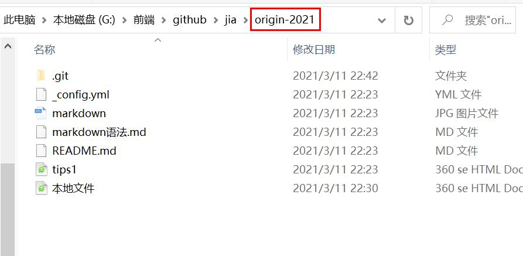

## 简介  
> Git 是最强大的分布式版本控制系统，没有之一。想要多人一起合作完成项目，学习 Git 是非常有必要的。以下是一些自己的学习笔记，主要参考自[廖雪峰的Git教程](https://www.liaoxuefeng.com/wiki/896043488029600)。

## 安装 Git  
> 在 Windows 上使用 Git，可以从 Git 官网直接下载安装程序，然后按默认选项安装即可。

安装好后，每个机器需要自报家门：  
```
$ git config --global user.name "Your Name"
```  
```
$ git config --global user.email "email@example.com"
```  
注意 `--global` 参数，表示该机器的所有 Git 仓库都会使用这个配置，当然也可以对某个仓库指定不同的用户名和Email地址。

## 创建版本库  
> 版本库又名仓库，英文名 repository，可以简单理解成一个目录。Git 可以管理目录里面的所有文件，甚至任何时刻都可以追踪历史，或者在将来某个时刻可以“还原”。

创建一个版本库，需要在合适的地方创建一个空目录
```
$ mkdir 文件夹名
$ cd 文件夹名
$ pwd
/将会出现当前目录
```
`pwd` 命令用于显示当前目录。  
**若使用 Windows 系统，为了避免遇到各种莫名其妙的问题，请确保目录名（包括父目录）不包含中文。**  
然后，通过 `git init` 命令把这个目录变成Git可以管理的仓库:  
```
$ git init
Initialized empty Git repository in 当前目录/.git/
```
可以使用 `ls -ah` 命令查看隐藏的.git目录

### 把文件添加到版本库  
> 编写的文件，要放到当前目录下（或它的子目录），确保它放到了 Git 仓库中。

首先，用命令 `git add`，把文件添加到仓库：  
```
$ git add 加后缀的文件名
```  
然后，用命令 `git commit`，把文件提交到仓库：  
```
$ git commit -m "提交说明"
[master (root-commit) eaadf4e] xxxx
 1 file changed, 2 insertions(+)
 create mode 100644 文件名 
```  
执行成功后，告知：`1 file changed`: 1个文件被改动;`2 insertions`：插入了两行内容。

要知道 commit 可以一次提交很多文件，所以可以**多次 add 不同的文件**：  
```
$ git add file1.txt
$ git add file2.txt file3.txt
$ git commit -m "add 3 files."
```

### 注意事项  
Git 命令必须在 **Git 仓库目录内**执行（git init 除外），在仓库目录外执行是没有意义的。  
添加某个文件时，该文件必须在当前目录下**存在**（ 有时会不小心写错文件名 ），可以用 `ls` 命令查看当前目录的文件。  

- 所有的版本控制系统（包括 Git），其实**只能跟踪文本文件的改动**，比如 TXT 文件，网页，所有的程序代码等等；对于（二进制文件）图片、视频、Word，只能知道大小的变化，没法跟踪。  
因为文本是有编码的，建议使用标准的 *UTF-8编码* 。  
- **Windows 的记事本**  
不要使用 Windows 自带的记事本编辑任何文本文件，会遇到很多不可思议的问题，建议下载 [Notepad++](http://notepad-plus-plus.org/) 代替记事本。  
- Unix 的哲学是“ 没有消息就是好消息 ”。

## 版本回退  
> 每当你觉得文件修改到一定程度的时候，就可以“保存一个快照”，这个快照在 Git 中被称为 commit。一旦你把文件改乱了，或者误删了文件，还可以从最近的一个 commit 恢复，然后继续工作。

假设文件 a.html共有几个版本被提交到 Git 仓库里（以下为 *提交说明* ）：  
- create  
- change 1  
- change 2  

版本控制系统可以告诉我们历史记录，在 Git 中，我们用 `git log` 命令查看：  
**git log** 命令显示 **从最近到最远** 的提交日志，最近的一次是 *change 2*。  

如果嫌输出信息太多，看得眼花缭乱的，可以试试加上 `--pretty=oneline` 参数：  
```
$ git log --pretty=oneline
1094adb7b9b3807259d8cb343e7df1d4d6477073 (HEAD -> master) change 2 
e475afc93c209a690c39c13a26716e8fa000c366 change 1
eaadf4e385e865d25c48e7ca1c8395c3f7dfaef0 create
```   
其中，开头的那一大串类似 1094adb... 的是 **`commit id`（版本号）**，一个用十六进制表示的庞大数字，方便多人在同一个版本库里工作。

### 回退到上一个版本    
在Git中，用 `HEAD` 表示当前版本，也就是最新的提交1094adb...，上一个版本就是 `HEAD^`，上上一个版本就是 `HEAD^^`，往上 100 个版本可以写成 `HEAD~100`。

把 a.html 回退到上一个版本，也就是 change 1 的版本，就可以使用 `git reset` 命令：  
```
$ git reset --hard HEAD^
HEAD is now at e475afc change 1
```

此时用 `git log` 再看看现在版本库的状态,会**看不到**最新的那个版本 *change 2*  
可以在上面的命令行窗口中找到 *change 2* 的 `commit id` 是 1094adb...，于是就可以指定回到未来的某个版本：  
```
$ git reset --hard 1094a
HEAD is now at 83b0afe change 2
```  
版本号没必要写全，前几位就可以了，能够使 Git 找到唯一的版本号

Git 的版本回退速度非常快，因为 Git 在内部有个指向当前版本的 HEAD 指针，当回退版本的时候，Git仅仅是把 HEAD 的指向改变，然后顺便把工作区的文件更新了。

当关闭了命令行窗口后，第二天回来 **忘记了的** 新版本的 `commit id` ,想要找回来。  
Git 提供了一个命令 `git reflog` 用来查看命令历史：    
```
$ git reflog
e475afc HEAD@{1}: reset: moving to HEAD^
1094adb (HEAD -> master) HEAD@{2}: commit: change2
e475afc HEAD@{3}: commit: change1
eaadf4e HEAD@{4}: commit (initial): create
```

## 工作区和暂存区  
> 暂存区是 Git 非常重要的概念，弄明白了暂存区，就弄明白了 Git 的很多操作到底干了什么。  

### 工作区 （Working Directory）
就是在电脑里能看到的目录，如之前创建版本库前所创建的空**目录文件夹**，或拷贝下来的文件夹。  


### 版本库（Repository）  
工作区有一个隐藏目录 `.git`，这个不算工作区，而是 Git 的版本库。

Git 的版本库里存了很多东西，其中最重要的就是称为 stage（或者叫 index ）的**暂存区**，还有 Git 为我们**自动创建**的第一个分支 master，以及指向 master 的一个指针叫 HEAD。  
  
把文件往 Git 版本库里添加的时候，是分两步执行的：  
第一步是用 `git add` 把文件添加进去，实际上就是**把文件修改添加到暂存区**；  
第二步是用 `git commit` 提交更改，实际上就是把暂存区的**所有内容提交到当前分支**。  
因为我们创建 Git 版本库时，Git 自动为我们创建了唯一一个 `master` 分支，所以，现在，`git commit` 就是往 `master` 分支上提交更改。

可以简单理解为，需要提交的文件修改通通放到暂存区，然后，一次性提交暂存区的所有修改。  

进行这样的操作：修改文件 *a.html*，并新建文件 *b.html*  
此时用 `git status` 查看的状态：  
```
$ git status
On branch master
Changes not staged for commit:
  (use "git add <file>..." to update what will be committed)
  (use "git checkout -- <file>..." to discard changes in working directory)

	modified:   readme.txt

Untracked files:
  (use "git add <file>..." to include in what will be committed)

	LICENSE

no changes added to commit (use "git add" and/or "git commit -a")
```
Git 告诉我们，*a.html* 被修改了，而 *b.html* 还从来没有被添加过，所以它的状态是 **Untracked**。  

然后，用两次命令 `git add` ，把两个文件添加后，用 `git status` 查看的状态：  
```
$ git status
On branch master
Changes to be committed:
  (use "git reset HEAD <file>..." to unstage)

	new file:   LICENSE
	modified:   readme.txt
 ```  
 此时暂存区的状态：   
 （直接用的别人的图，故那两个文件名会有所不同）  
   
 然后，执行 `git commit` 后，用 `git status` 查看的状态：  
 ```
 $ git status
On branch master
nothing to commit, working tree clean
 ```  
 即提交后，如果又没有对工作区做任何修改，那么工作区就是“干净”的。  
 
 版本库的暂存区中也没有内容了。    
   
 
 
 
 


