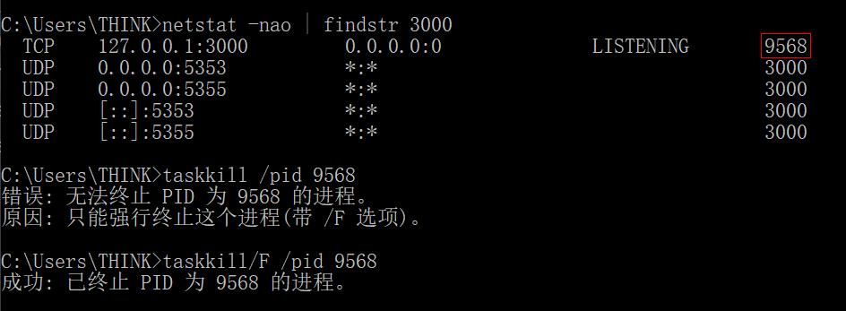

- 简单介绍
  + [Node_js简介](#Node_js简介)
    - [大量的库](#大量的库)
    - [Node_js应用程序的示例](#Node_js应用程序的示例)
    - [Node_js框架和工具](#Node_js框架和工具)
  + [Node_js与浏览器的区别](#Node_js与浏览器的区别)  
  + [报错处理_占用端口号](#报错处理_占用端口号)  
- 入门教程
  + [V8_JavaScript引擎](#V8_JavaScript引擎)
  + [从命令行运行Node_js脚本](#从命令行运行Node_js脚本)
  + [从Node_js程序退出](#从Node_js程序退出)
  + [读取环境变量](#读取环境变量)
  + [使用Node_js的REPL](#使用Node_js的REPL)
  + [从命令行接收参数](#从命令行接收参数)
  + [使用Node_js输出到命令行](#使用Node_js输出到命令行)
    - [使用控制台模块](#使用控制台模块)
    - [计算耗时](#计算耗时)
    - [为输出着色](#为输出着色)
    - [创建进度条](#创建进度条)

### Node_js简介    

索引 | 说明  
:-: | :-  
① | 开源与跨平台的 JavaScript 运行时环境
② | 在浏览器外运行 V8 JavaScript 引擎（Google Chrome 的内核）
③ | Node.js 应用程序运行于单个进程中，无需为每个请求创建新的线程  
④ | 其标准库中提供了一组异步的 I/O 原生功能，能防止 JavaScript 代码被阻塞
⑤ | Node.js 中的库通常是使用非阻塞的范式编写  
⑥ | 执行 I/O 操作时，会在响应返回时恢复操作，而不是阻塞线程并浪费 CPU 循环等待
⑦ | 这使 Node.js 可以在一台服务器上处理数千个并发连接，而无需引入管理线程并发的负担  
⑧ | 在高版本中，可以使用新的 ECMAScript 标准，而不用理浏览器  

#### 大量的库  

npm 的结构很简单，其仓库托管了众多可以自由使用的开源库包，有助于 Node.js 生态系统的激增。

#### Node_js应用程序的示例  
> Web服务器  

顺序 | 说明  
:-: | :-  
① | 引入 `http` 模块
② | `http` 的 createServer() 方法会创建新的 HTTP 服务器并返回它
③ | 服务器被设置为监听指定的端口和主机名。当服务器就绪后，回调函数会被调用
④ | 每当接收到新的请求时，request 事件回调会被调用，并提供请求和响应对象
⑤ | 这里设置了响应状态码、响应头
⑥ | 关闭响应，添加内容作为 `end()` 的参数
⑦ | 在命令行 `node 文件名` 启动服务器  

```
const http = require('http')

const hostname = '127.0.0.1'
const port = 3000

const server = http.createServer((req, res) => {
  res.statusCode = 200
  res.setHeader('Content-Type', 'text/plain')
  res.end('你好世界\n')
})

server.listen(port, hostname, () => {
  console.log(`服务器运行在 http://${hostname}:${port}/`)
})
```

#### Node_js框架和工具  

清单 | 描述 
:-: | :-  
Express | 提供了创建 Web 服务器的最简单但功能最强大的方法之一  


#### Node_js与浏览器的区别  

索引 | 环境 | 说明  
:-: | :- | :-   
① | Node.js | 使用单一语言轻松编程前端和后端
② | Node.js | 没有 document、window 等对象和 Web 平台 API（如Cookie）
② | 浏览器 | 没有模块提供的 API，如文件系统访问功能  
③ | Node.js | 可以控制运行环境，支持新技术
③ | 浏览器 | 发展较慢，用户升级慢，使用旧 JS/ES 版本
④ | 浏览器 | 使用 Babel 将代码转换为与 ES5 兼容的代码
④ | Node.js | 不需要
⑤ | Node.js | 使用 CommonJS 模块系统，即 `require()`
⑤ | 浏览器 | 实现 ES 模块标准，即 `import`

#### 报错处理_占用端口号  

索引 | 环境 | 命令  
:-: | :- | :-   
① | 打开cmd | /
② | 查询哪个程序占用该端口（这里举例3000） | netstat -nao \| findstr 3000
③ | 查看该进程 | tasklist \| findstr `对应PID`
④ | 终止该进程 | taskkill /pid `对应PID`
⑤ | 强杀该进程 | taskkill/F /pid `对应PID`



----  

#### V8_JavaScript引擎    

索引 | 说明  
:-: | :-  
① | V8 是为 Google Chrome 提供支持的 JavaScript 引擎的名称。负责处理并执行 JS
② | V8 提供了执行 JavaScript 的运行时环境。 DOM 和其他 Web 平台 API 则由浏览器提供
③ | 使用 C++ 编写，并且不断地被改进
④ | JS 通常被认为是一门解释型的语言，但是现代的 JS 引擎不再只是解释 JS，也会对其进行编译
⑤ | JS 是由 V8 在其内部编译的，使用了**即时（JIT）编译**以加快执行速度

#### 从命令行运行Node_js脚本  

顺序 | 说明  
:-: | :-  
① | 确保[安装](https://nodejs.org/zh-cn/download/)了 node
② | `node 文件路径/文件名.js`

#### 从Node_js程序退出   
> `process` 模块无需引入，自动可用。

索引 | 方式 | 概述 | 说明  
:-: | :-: | :- | :- 
① | 控制台 | / | `ctrl-C`
② | 编程 | 强制终止 | `process.exit()`
② | 编程 | 强制终止 | 异常终止回调、请求、文件访问等
② | 编程 | 强制终止 | 可以传入一个整数，向操作系统发送[退出码](http://nodejs.cn/api/process.html#process_exit_codes)
② | 编程 | 强制终止 | 默认为 0，表示成功
③ | 编程 | 设置退出码 | `process.exitCode = 1`  
③ | 编程 | 设置退出码 | 当进程完成所有处理后，程序会正常地退出，并返回该退出码  
③ | 编程 | 正常终止 | [待学习](http://nodejs.cn/learn/how-to-exit-from-a-nodejs-program)  

#### 读取环境变量  

索引 | 说明  
:-: | :-  
① | 通过 `process.env.NODE_ENV` 可以读写环境变量   
② | 如 "development" 和 "production"
③ | :bug:获取不到默认值？

#### 使用Node_js的REPL  
> REPL 也被称为运行评估打印循环，是一种编程语言环境（主要是控制台窗口），它使用单个表达式作为用户输入，并在执行后将结果返回到控制台。  

索引 | 概述 | 命令行操作    
:-: | :- | :-   
① | 启用该模式 | `node`  
② | 自动补全 | 使用 `tab` 键，自动补全提示内容 
③ | 提示类属性和方法 | `Number.` + `tab`
④ | 提示全局对象 | `global.` + `tab`
⑤ | 打印最后操作结果 | `_`
⑥ | 退出 | `.exit` 或 `ctrl-c` 两次

#### 从命令行接收参数  

参数传递  
```
// 情况一：独立参数
node app.js joe  

// 情况二：键值对形式  
node app.js name=joe
```

获取参数     
> 通过 `process.argv` 这个数组，可以获取所有命令行调用参数。  

数组元素 | 说明  
:-: | :-  
第一个 | `node` 命令的完整路径 
第二个 | 正被执行的文件的完整路径
之后的 | 命令行的调用参数

获取参数二  
> 针对情况二，使用 [minimist](https://www.npmjs.com/package/minimist) 库，能更好的处理参数。  

顺序 | 说明  
:-: | :-  
① | 安装minimist库
② | 这种方法需要在每个参数前加双破折号
③ | 导入，取剩余数组作为参数  

```
npm install minimist -S

node app.js --name=joe

/* app.js */
const args = require('minimist')(process.argv.slice(2))
console.log(args['name']); //joe
```

#### 使用Node_js输出到命令行   

概述 | 说明 | 代码     
:- | :- | :-      
[控制台模块](http://nodejs.cn/api/console.html)的**基础**输出 | 最简单的输出 | `console.log()`
清空控制台显示 | 让当前区域干净 | `console.clear()`
元素计数 | 同时输出该字符串的输出次数，全等则加一 | `console.count()`
计算耗时 | 可以计算并输出[被夹函数](#计算耗时)的执行时间 | `console.time()`、`console.timeEnd()`
stdout | 标准输出 | `console.log()`
stderr | 出现在错误日志 | `console.error`  
[为输出着色](#为输出着色) | 演示输出黄色的底层方法 | `console.log('\x1b[33m%s\x1b[0m', '你好')`
创建进度条 | 需要安装导入 `progress` 库 | [跳转](#创建进度条)  

#### 使用控制台模块  
> 这样会将后面参数改变格式后添加到首参。  
```
console.log('我的%s已经%d岁', '猫', 2)

// 我的猫已经2岁
```

- `%s` 会格式化变量为字符串
- `%d` 会格式化变量为数字
- `%i` 会格式化变量为其整数部分
- `%o` 会格式化变量为对象

#### 计算耗时  

```
const doSomething = () => console.log('测试')
const measureDoingSomething = () => {
  console.time('doSomething()')
  doSomething()
  console.timeEnd('doSomething()')
}
measureDoingSomething()
```

#### 为输出着色  
> **安装**并导入 `Chalk` 库，还能设置其他样式，如粗体、斜体或带下划线。   

```
const chalk = require('chalk')

console.log(chalk.yellow('你好'))
```

#### 创建进度条  
> 创建一个 10 步的进度条，每 100 毫秒完成一步。当进度条结束时，则清除定时器。  

```
const ProgressBar = require('progress')

const bar = new ProgressBar(':bar', { total: 10 })
const timer = setInterval(() => {
  bar.tick()
  if (bar.complete) {
    clearInterval(timer)
  }
}, 100)
```

#### 从命令行接收输入  

名称 | 类型 | 说明 | 安装  
:- | :- | :- | :-
readline | 模块 | 每次一行地从可读流获取输入 | /  
readline | 模块 | 可读流，如 `process.stdin` 流，在 Node.js 程序执行期间该流就是终端输入 | /  
readline-sync | 软件包 | 接口与 `readline` 相似。可将用户输入显示为 `*`，用于密码 | 需要  
Inquirer | 软件包 | 很强大，可以询问多项选择、展示单选按钮、确认等 | [需要](https://github.com/SBoudrias/Inquirer.js)  

#### readline  
> `question()` 方法的首参为问题，用户输入内容并按下回车时，执行回调。  

```
const readline = require('readline').createInterface({
  input: process.stdin,
  output: process.stdout
})

readline.question(`你叫什么名字?`, name => {
  console.log(`你好 ${name}!`)
  readline.close()
})
```

#### readline-sync

```
var readlineSync = require('readline-sync');
 
// 将等待用户输入，再执行后面的代码
var userName = readlineSync.question('May I have your name? ');
console.log('Hi ' + userName + '!');
 
// 用户输入将显示为 *  
var favFood = readlineSync.question('What is your favorite food? ', {
  hideEchoBack: true
});
console.log('Oh, ' + userName + ' loves ' + favFood + '!');
```

#### 使用exports从Node_js文件中导出  
> Node.js 具有内置的模块系统。  
> 
> Node.js 文件可以导入其他 Node.js 文件公开的功能。  
> 
> [module系统](http://nodejs.cn/api/modules.html)有两种导出方式。`module.exports` 公开了它指向的对象，`export` 公开了它指向的对象的属性。  

#### module_exports
> 只导出该对象。  

```
const car = {
  brand: 'Ford'
}

module.exports = car

/* 导入文件 */
const car = require('./car')
```

#### exports

```
const car = {
  brand: 'Ford'
}
exports.car = car

// 或者直接导出
exports.car = {
  brand: 'Ford'
}

/* 导入文件 */
const car = require('./items').car

// 或者通过属性使用  
const items = require('./items')
items.car
```

#### npm包管理器  
> `npm` 是 Node.js 标准的软件包管理器，其一个替代选择是[Yarn](https://classic.yarnpkg.com/en/)。  
> 
> `npm` 可以管理项目依赖的下载。  

概述 | 说明 | 命令     
:- | :- | :-      
安装所有依赖 | 根据项目的 `package.json`，（创建） `node_modules` 文件夹并在其中安装项目所需的所有东西 | npm install
安装单个软件包 | 安装特定的软件包 | npm install `<package-name>`
更新所有软件包 | 检查所有软件包是否有满足版本限制的更新版本 | npm update
更新单个软件包 | / | npm update `<package-name>`  
版本控制 | 根据 `package.json` 指定库的显式版本以便整个团队运行相同的版本 | 解决兼容、缺陷  
运行任务 | 在 `package.json` 的 `"script"` 中起长命令的别名 | npm run `<task-name>`

#### 安装单个软件包  
> 可以添加更多的标志。  

标志 | 简写 | 说明 | 解释  
:- | :- | :- | :-   
--save | -S | 安装并添加条目到 `package.json` 文件的 dependencies | 通常是开发的工具（例如测试的库）
--save-dev | -D | 安装并添加条目到 `package.json` 文件的 devDependencies | 与**生产环境**中的应用程序相关  
-g | | 全局安装 | 通过 `npm root -g` 查看全局目录的位置  
无 | | 本地安装 | 安装在 `./node_modules` 下，并在 `package.json` 的 `dependencies` 属性中添加相应条目

#### 运行任务  

```
/* package.json */
{
  "scripts": {
    "start-dev": "node lib/server-development",
    "start": "node lib/server-production"
  },
}

// 运行 Webpack
{
  "scripts": {
    "watch": "webpack --watch --progress --colors --config webpack.conf.js",
    "dev": "webpack --progress --colors --config webpack.conf.js",
    "prod": "NODE_ENV=production webpack -p --config webpack.conf.js",
  },
}
```

#### 使用或执行npm安装的软件包  

#### 普通软件包  
> 软件包会安装到本地的 `node_modules` 文件夹中。  

```
/* 命令行 */
npm install **  

/* 导入到需要使用它的文件 */
const _ = require('**')
```

#### 可执行文件  
> 可执行文件会放到 `node_modules/.bin/` 文件夹下。  

```
/* 命令行 */
npm install cowsay

/* 执行该文件的旧方案 */
.\node_modules\.bin\cowsay 

/* 新版本支持 */
npx cowsay hey！
```

#### package.json指南  
> `package.json` 文件是项目的清单。它可以做很多完全互不相关的事情。例如，它是用于工具的配置中心。它也是 npm 和 yarn 存储所有已安装软件包的名称和版本的地方。

#### 文件结构  
> 对于应用程序，`package.json` 文件中的内容没有固定的要求，空的 `{}` 也可以。

```
/* 该示例是从 Vue.js 应用程序示例中提取的 */
{
  "name": "test-project",
  "version": "1.0.0",
  "description": "A Vue.js project",
  "main": "src/main.js",
  "private": true,
  "scripts": {
    "dev": "webpack-dev-server --inline --progress --config build/webpack.dev.conf.js"
  },
  "dependencies": {
    "vue": "^2.5.2"
  },
  "devDependencies": {
    "autoprefixer": "^7.1.2"
  },
  "engines": {
    "node": ">= 6.0.0",
    "npm": ">= 3.0.0"
  },
  "browserslist": ["> 1%", "last 2 versions", "not ie <= 8"]
}
```

属性 | 这些属性可被 npm 或其他工具使用  
:- | :-
version | 指定软件包的当前版本
name | 设置了应用程序/软件包的名称
description | 是应用程序/软件包的简短描述
main | 设置了应用程序的入口点
private | 设置为 true 可以防止应用程序/软件包被意外地发布到 `npm`
scripts | 定义了一组可以运行的 node 脚本
dependencies | 设置了作为依赖安装的 `npm` 软件包的列表
devDependencies | 设置了作为开发依赖安装的 npm 软件包的列表
engines | 设置此软件包/应用程序能在哪个版本的 Node.js 上运行
browserslist | 告知要支持哪些浏览器（及其版本）

#### 属性分类  
> 这里介绍的大多数属性仅可用于[npm](https://www.npmjs.com/)。  

属性 | 说明 | 示例  
:- | :- | :-  
name | 设置软件包的名称 | `"name": "nodejs_cn"`
author | 列出软件包的作者名称、邮箱、地址 | `"author": "NodeJS中文网 <mail@nodejs.cn> (http://nodejs.cn)"` 、
contributors | 列出贡献者 | `"contributors": ["NodeJS中文网 <mail@nodejs.cn> (http://nodejs.cn))"]` 、
bugs | 链接到软件包的问题跟踪器，如 GitHub 的 issues 页面 | `"bugs": "https://github.com/nodejscn/node-api-cn/issues"`
homepage | 设置软件包的主页 | `"homepage": "http://nodejs.cn"`
version | 指定软件包的当前版本 | `"version": "1.0.0"`
license | 指定软件包的许可证 | `"license": "MIT"`
keywords | 有助于浏览相似软件包或浏览[npm](https://www.npmjs.com/)时找到该软件包 | `"keywords": ["machine learning", "ai"]`
description | 对软件包的简短描述，发布到[npm](https://www.npmjs.com/)时让人知道它的功能 | `"description": "NodeJS中文网入门教程"`
repository | 指定此程序包仓库所在的位置 | `"repository": "github:nodejscn/node-api-cn",` 、
main | 设置软件包的入口点 | `"main": "src/main.js"`  
private | 防止应用程序/软件包被意外地发布到 `npm` | "private": true
scripts | 定义一组可以运行的 node 脚本，简写 | 调用：`npm run XX`
dependencies | 设置作为依赖安装的 `npm` 软件包的列表 | `"dependencies": {"vue": "^2.5.2"}`
devDependencies | 设置作为**开发依赖**安装的 `npm` 软件包的列表 | `"dependencies": {"autoprefixer": "^7.1.2"}`
engines | 设置此软件包/程序要运行的 Node.js 或其他命令的版本 | `"engines": {"node": ">= 6.0.0", "npm": ">= 3.0.0"}`
browserslist | 告知要支持哪些浏览器（及其版本） | [跳转](#browserslist)  

#### name  

索引 | 说明  
:- | :- 
① | 名称必须少于 214 个字符，只能包含小写字母、`-` 或 `_`
② | 当软件包在 `npm` 上发布时，它会基于此属性获得自己的 URL

#### browserslist  
> Babel、Autoprefixer 和其他工具会用到它，以将所需的 polyfill 和 fallback 添加到目标浏览器。  

```
"browserslist": [
  "> 1%",
  "last 2 versions",
  "not ie <= 8"
]
```
> 此配置意味着需要支持使用率[超过](https://caniuse.com/) 1％的所有浏览器的最新的 2 个主版本，但不含 IE8 及更低的版本。  

#### 命令特有的属性  

- `package.json` 文件还可以承载命令特有的配置，例如 Babel、ESLint 等。  

- 每个都有特有的属性，例如 `eslintConfig`、`babel` 等。  

#### package-lock.json文件  
> 跟踪被安装的每个软件包的确切版本，以便产品可以以相同的方式被 100％ 复制。  
> 
> 该文件需要被提交到 Git 仓库，以便被其他人获取。  

命令 | 说明  
:- | :- 
npm install | 会使用该文件中的确切版本，初始化项目  
npm update | 该文件中的依赖的版本会被更新  

字段 | 说明  
:- | :-   
require | 该软件包依赖的其它软件包
version | 确切版本  
resolved | 指向软件包位置
integrity | 用于校验软件包的字符串  

#### 查看npm包安装的版本  

命令 | 说明 | 补充
:- | :- | :-     
npm list | 查看所有已安装的 npm 软件包及其依赖包的版本 | 也可以视觉扫描 `package-lock.json`
npm list -g | 适用于全局安装的软件包 | /
npm list --depth=0 | 仅获取顶层的软件包 | 基本上就是告诉 npm 要安装并在 `package.json` 中列出的软件包  
npm list `<package-name>` | 获取特定软件包的版本 | 也适用于安装的软件包的依赖
npm view `<package-name>` version | 查看软件包在 npm 仓库上最新的可用版本 | /

#### 安装npm包的旧版本  

命令 | 说明 
:- | :-   
npm install `<package>`@`<version>` | 安装指定版本  
npm view `<package>` versions | 列出软件包所有的以前的版本

#### 将所有软件包更新到最新版本  

1. 使用 `npm install <packagename>` 安装软件包时，该软件包最新的可用版本会被下载并放入 `node_modules` 文件夹中，并且还会将相应的条目添加到当前文件夹中存在的 `package.json` 和 `package-lock.json` 文件中。  

2. 如果有新的次版本或补丁版本，并且输入了 `npm update`，则已安装的版本会被更新，并且 `package-lock.json` 文件会被新版本填充。`package.json` 则保持不变。

3. 使用 `npm outdated` 可以查看软件包的新版本。  

4. 要想跟新主版本，注意可能引入重大改变。  

顺序 | 步骤 | 命令 
:- | :- | :-
① | 局地安装该软件包  | npm install -g npm-check-updates  
② | 升级 `package.json` 中两种依赖的所有版本 | ncu -u
③ | 运行跟新 | npm update  
④ | 补充：若只下载了项目，还没安装包 | npm install


