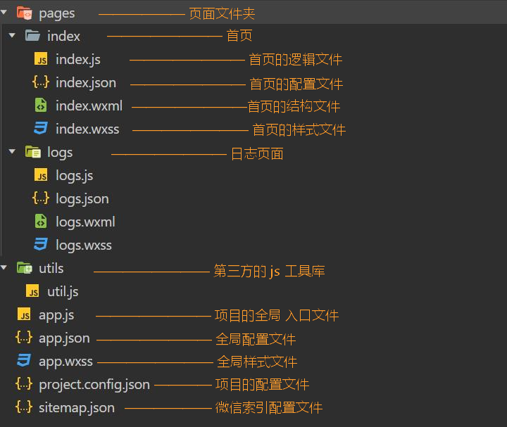

#### 起步

1. 申请[账号](https://developers.weixin.qq.com/miniprogram/dev/framework/quickstart/getstart.html#申请帐号) ，需要提供邮箱、管理员用微信扫码。  

2. 在[小程序后台](https://mp.weixin.qq.com/)，（开发管理-开发设置）可以获取 AppID，其相当于小程序的身份证，调用某些接口需要用到它。  

3. 安装[开发工具](https://developers.weixin.qq.com/miniprogram/dev/devtools/download.html)，用于预览效果。编写代码可以用 VS Code。  

4. 对于测试功能，打开开发工具后，创建小程序，**选择一个空目录**，使用测试号，即可实现第一个小程序。 

5. 后期可以打开项目后，在 `详情` 修改 AppId。  

#### 目录结构

小程序文件结构  
> 只几个文件只要相应的名字相同，就会自动产生追踪关系，不需导入。  

类型 | 传统web | 微信小程序
:-: | :-: | :-: 
结构 | HTML | WXML 
样式 | CSS | WXSS
逻辑 | Javascript | Javascript
配置 | 无 | JSON



文件 | 说明
:-: | :-: 
project.config.json | 也可以在 `详情` 的 UI 界面进行设置 
sitemap.json | 用于配置小程序及其页面是否允许被微信索引  

#### app.json  
> 用来对微信小程序进行全局配置，决定页面文件的路径、窗口表现、设置网络超时时间、设置多 tab 等。  
>
> 小程序页面也可以使用同名 `.json` 文件（仅能）对窗口表现进行配置，会覆盖全局的 `window` 中相同的配置项。
>
> 使用开发者工具进行配置时，会有相应字段的提示和补全功能。  

pages字段    
> 决定页面文件的路径。  

1. 每个数组元素都对应着一个页面的路径，最后项不需要后缀名。  

2. 使用开发工具，在该选项下新增元素并保存，会自动生成对应的页面文件。  

3. 首个数组元素对应的路径将展示为首页。  

window字段  
> 定义小程序所有页面的顶部背景颜色，文字颜色等。  

常用属性 | 说明 | 默认值 | 可选值
:- | :- | :- | :-
navigationBarBackgroundColor | 导航栏背景颜色 | "#fff" | *HexColor*
navigationBarTitleText | 导航栏标题 | "Weixin" | *str*
navigationBarTextStyle | 导航栏标题颜色 | "black" | "white"
backgroundTextStyle | 下拉加载，指示器颜色 | "dark" | "light"
enablePullDownRefresh | 开启当前页面下拉刷新 | false | true
backgroundColor | 下拉加载部分窗口颜色 | "#ffffff" | *HexColor*

tabBar字段  
> 指定 tab 栏的表现，以及 tab 切换时显示的对应页面。  
> 
> 将 icon 文件夹建在与全局配置同级处。  

常用属性 | 说明 | 默认值 | 可选值
:- | :- | :- | :-
list | 标签列表，需 2-5 个 | / | *arr*
color | 未激活文字颜色 | / | *HexColor*
selectedColor | 激活文字颜色 | / | *HexColor*
backgroundColor | 标签栏背景色 | / | *HexColor*
position | 标签栏位置 | "bottom" | "top" （此时不显示 icon）

list属性 | 说明 | 默认值 | 可选值
:- | :- | :- | :-
pagePath | 页面路径，必须在 pages 中先定义 | / | *str*
text | tab 上按钮文字 | / | *str*
iconPath | 图片路径。icon 大小限制为 40kb， | / | *str*
selectedIconPath | 激活图片路径。建议尺寸为 81px * 81px | / | *str*

#### 页面配置  
> 仅对页面的窗口表现进行配置，不需要添加字段。  

#### 开发技巧  

1. 可以在 VSCode，安装插件 `小程序开发助手`，具备配置字段提示、标签提示等功能。  

2. 在逻辑文件（js）中，输入 `page`，选择提示的第二项可以补全架构。  

3. 快速选择多行中间部分（如对象的所有键）：①选中首行选区 ②`Alt` /+ `Shift` + 选中尾行选区尾部

4. 快速多行输入相同内容： ①选择首行输入位 ②`Alt` /+ `Shift` + 选中尾行输入位 ③输入内容

快捷键 | 作用
`Alt` \+ `↑` | 选中行代码上移

小程序 | Vue | 说明  
:-: | :-: | :-
<text\> | <span\> | 行内元素，不换行
<view\> | <div\> | 块级元素，换行
<block\> | <template\> | 不参与渲染，可充当循环结构的容器或条件渲染种包含多元素的**容器**等

#### 模版语法  
> 可以往花括号里添加变量、表达式。  

性质 | 小程序 | Vue 
:-: | :-: | :-
文本节点 | {{}} | {{}}
属性值 | {{}} | 使用 v-bind
条件渲染 | {{}} | 绑定变量

#### 列表渲染  
> 不用于 Vue，除了数组以外，也可以遍历对象。  
> 
> 可以自定义在循环内部的项的变量名，方便实现嵌套循环。  

```
wx:for="{{arr | obj}}"
```

其它属性 | 遍历数组 | 遍历对象 | 默认值
:- | :- | :- | :-
wx:for-item | 项 | 值 | "item"
wx:for-index | 索引 | 键 | "index"
wx:key | 需唯一 | / | "\*this"

wx:key
> 如果明确知道该列表是静态，或者不必关注其顺序，可以不提供该值，忽略警告。  
> 
> 值以两种形式提供:
> 
> 1. 字符串，代表遍历项的**某个属性**，其值需唯一且不能动态改变。
> 
> 2. `*this`，代表项本身，需要项是唯一的字符串或者数字。

```
// mine.wxml
<view wx:for="{{list}}" wx:for-item="item" wx:for-index="index" wx:key="name">
  {{item.name}} - {{item.age}}
</view>

// mine.js
data: {
  list: [
    { name: 'aaa', age: 12 },
    { name: 'bbb', age: 15 }, 
    { name: 'ccc', age: 16 }
  ]
},
```

#### 条件渲染  
> `wx:if` 是惰性的，切换条件时进行**局部渲染**或销毁。  

小程序 | Vue | 说明  
:-: | :-: | :-
wx:if | v-if | 动态绑定
wx:elif | v-else-if | 动态绑定
wx:else | v-else | 不需绑定
hidden | v-show | 动态绑定

#### 认识事件  
> 尝试通过表单输入值，改变输出值，另外提供两个按钮，也可以改变该输出值。  

1. 对于单标签，不添加结束的 `/` 会报错。  
2. `data` 选项是对象形式而非函数。  
3. 对于绑定的事件，与 `data` 同级，而不需要加到 `methods` 中。  
4. 要对 `data` 内的数据赋值时，不能直接赋值，要使用 `this.setData`。
5. 获取时，需要通过 `this.data`。    
6. 在小程序中，模版中绑定的事件处理程序不能添加括号，更无法直接传参。  
7. 需要借助自定义属性来传参。  

```
<button bind:tap="handleTap" data-operation="{{1}}">+</button>
<button bind:tap="handleTap" data-operation="{{-1}}">-</button>
<input type="text" bind:input="handleInput" />
<view>{{num}}</view>

data: {
  num: 0
},
handleInput(e) {
  this.setData({
    num: e.detail.value
  })
},
handleTap(e) {
  const operation = e.currentTarget.dataset.operation;
  this.setData({
    num: +this.data.num + operation
  })
}
```

#### 事件类型  

事件分类 | 说明  
:- | :-
冒泡事件 | 组件上的事件被触发后，会向父节点传递
非冒泡事件 | 组件上的事件被触发后，不会向父节点传递

普通事件绑定  
> 在后续版本中，支持在 bind 后添加 `:`。  

形式 | 说明  
:- | :-  
bindtap="handleTap" | 事件名后不能跟括号
bindtap="{{ handlerName }}" | `this.data.handlerName` 必须是一个字符串，指定事件处理函数名

绑定方式 | 说明  
:- | :- 
bind | 会继续冒泡
capture-bind | 会继续捕获
catch | 阻止冒泡
capture-catch | 中断捕获阶段和取消冒泡阶段
mut-bind | 只有一个节点的这种绑定事件会触发，不影响 `bind` 和 `catch`

### WXSS  

#### 尺寸单位
> rpx 可以根据屏幕宽度进行自适应，且规定屏幕宽为固定的 750rpx。
> 
> 如屏幕宽度为375px，则1rpx = 0.5px。
> 
> 如屏幕宽度为750px，则1rpx = 1px。  

栗子
> 如设计稿规定屏幕宽度为 xpx，现在需要去适配宽度为 100px。
>
> 使用 `calc`，需要注意数值与单位不留空格。  

步骤 | 说明 
:-: | :-: 
① | xpx = 750rpx
② | 1px = 750rpx / x
③ | 100px = 750rpx / x * 100
④ | width: calc(750rpx * 100 / x)

#### 导入  
> 使用 `@import` 语句可以导入外联样式表，只支持相对路径，需要用 `;` 表示语句结束。   

```
// xx.wxss
@import "../../styles/common.wsxx";
```

#### 支持的选择器  

选择器 | 样例 | 样例描述
:- | :- | :-
.class | .intro | 选择所有拥有 class="intro" 的组件
#id | #firstname | 选择拥有 id="firstname" 的组件
element | view | 选择所有 view 组件
element, element | view, checkbox | 选择所有文档的 view 组件和所有的 checkbox 组件
::after | view::after | 在 view 组件后边插入内容
::before | view::before | 在 view 组件前边插入内容

#### 使用less

1. 使用 VSCode。  
2. 安装插件 `easy less`
3. 打开设置图标 —— 设置 —— 右上角的 `json` 图标  
4. 将下面代码粘贴到对象内部的最后。  
5. 此时新建 `less` 并保存后，会自动生成对应的 `wxss`。   

```
"less.compile": {
  "outExt": ".wxss"
}
```


