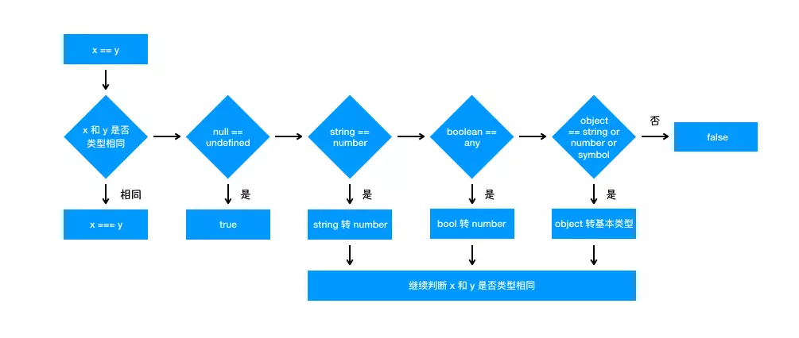

#### typeof类型判断
> `typeof` 对于原始类型来说，除了 null 都可以显示正确的类型。  
> 
> 可以考虑使用 `instanceof` [判断](https://github.com/SpringLoach/origin-2021/blob/happy-day/JavaScript/常用方法速查.md#类型判断)对象的类型，其机制是通过原型链来判断的。原始类型则不可。  

```
let x = new Array('abc');  
let y = ['abc'];

document.write(typeof x);            // object
document.write(typeof y);            // object
document.write(x instanceof Array);  // true
document.write(y instanceof Array);  // true
document.write(x.constructor);       // f Arr() {}
document.write(y.constructor);       // f Arr() {}
```

```
let x = new String('abc');
let y = 'abc';

document.write(typeof x);             // object
document.write(typeof y);             // string
document.write(x instanceof String);  // true
document.write(y instanceof String);  // false
document.write(x.constructor);        // f Str() {}
document.write(y.constructor);        // f Str() {}
```

----

#### this
> 使用 `this` 指定对象后，没有该变量就是 `undefined`， 不会向上查找。

位置 | 指向
:-: | :-:
直接调用 foo | 不管 foo 函数在哪，`this` 一定是 window
obj.foo() | 谁调用了函数，谁就是 `this`
构造器函数 | 指向新对象

```
function foo() {
  console.log(this.a)
}
var a = 1
foo()               // 1

function bar() {
  let a = 233
  foo()
}
bar()               // 1

const obj = {
  a: 2,
  foo: foo
}
obj.foo()           // 2

const c = new foo()     // undefined
```

箭头函数
> 箭头函数中的 this 只取决包裹箭头函数的**第一个**普通函数**的 this**。

```
function a() {
  return () => {
    return () => {
      console.log(this)
    }
  }
}
a()()()    // Window
```

改变上下文  
> 对于这种改变上下文的方法，嵌套时，`this` 永远由第一次 bind 决定。
```
let a = {}
function fn () { console.log(this) }

fn.bind()(a)    // Window
fn.bind(a)()    // {}
```


----

#### ==  

  

----

#### 解决var循环  
> 由于在异步前，全局 i 的值已经计算为 6，输出将全为 6。  
> 
> 可以将每轮循环的 i 值作为函数参数传入，也可以使用 `let` 运行在括号作用域。  

```
for (var i = 1; i <= 5; i++) {
  setTimeout(function timer() {
    console.log(i)
  }, i * 1000)
}
```

----

#### 深浅拷贝   
> 浅拷贝：如果对象中的值为对象，则拷贝的是地址。即可以对原对象产生影响。  

浅拷贝  
```
let a = { text: 123 }

// 方式一  
let b = Object.assign({}, a)

// 方式二  
let b = { ...a }
```

深拷贝  
```
// 将对象转换为 JSON 后，再转换为对象
let b = JSON.parse(JSON.stringify(a))
```

该方法的局限性 | 结果  
:- | :-:
会忽略 undefined | 忽略
会忽略 symbol | 忽略
不能序列化函数 | 忽略
不能解决循环引用的对象 | 报错

----

#### 原型  
> 对象的 `__proto__ ` 属性指向原型， `__proto__` 将对象和原型连接起来组成了原型链。  

属性 | 所属 
:- | :-:
\_\_proto\_\_ | 对象
prototype  | [函数](https://github.com/SpringLoach/origin-2021/blob/happy-day/JavaScript/第十章-函数.md#函数属性与方法)

#### var、let及const的区别

索引 | 说明  
:- | :-
① | var 存在提升，能在声明之前使用
② | let 和 const 在代码执行前会被 JS引擎解析，即**意味到该作用域有对应变量**，但无法使用
③ | 在全局作用域下使用 var 声明，变量会挂载在 window 上，其他两者不会
④ | let 和 const 作用基本一致，但是后者声明的变量不能再次赋值（包括引用值，即地址）  

#### 原型继承和Class继承  
> 其实在 JS 中并不存在类，class 只是语法糖，本质还是函数。  

组合继承  

项 | 方式  
:- | :-
继承属性 | `Parent.call(this, value1, ..)`
继承方法 | 父类实例作为原型
优势 | 可传参，引用属性不共享
缺点 | 调用了父类构造函数，子类原型上有多余属性，浪费内存
特征 | 父类为构造函数  

寄生组合继承

项 | 方式  
:- | :-
继承属性 | `Parent.call(this)`
继承方法 | 将父类的原型作为原型
优势 | 可传参，引用属性不共享
缺点 | /
特征 | 需将子类原型上的构造函数指向子类自身 

Class继承  
> class 实现继承的核心在于使用 `extends` 表明继承自哪个父类，并且在子类构造函数中必须调用 `super`，可以看成 `Parent.call(this, value)`。

#### 模块化  
> 早期使用立即执行函数实现模块化（解决命名冲突、污染全局变量的问题）。  
> 
> AMD 和 CMD 目前已很少使用。

优势  
- 解决命名冲突    
- 提供代码复用性  
- 提高代码可维护性  

CommonJS
> 最早是 Node 在使用，在 Webpack 中就能见到它。  

ES Module
> 与 CommonJS 不同，ES Module 导入的是拷贝值，不会因为导出值的改变而更新。  
> 
> 不支持动态导入。  

#### 简洁promise  

简化思路  

索引 | 步骤 | 小步骤
:- | :- | :-
① | 全局作用域 | 声明常量表示状态
② | MyPromise函数 | 保留作用域
③ | MyPromise函数 | 创建变量保存初始状态
④ | MyPromise函数 | 创建变量保存调用落定方法传入的参数
⑤ | MyPromise函数 | 创建变量（数组）保存 `then` 的回调
⑥ | MyPromise函数 | 创建落定方法，用于状态改变时执行相应所有回调
⑦ | MyPromise函数 | 将落定方法作为回调参数传出  
⑧ | then函数 | 保留作用域 
⑨ | then函数 | 判断参数类型，是否传入 
⑩ | then函数 | 等待状态时，往 `then` 的回调中推入函数
... | then函数 | 非等待状态时，执行函数  


#### 执行栈  
> 可以把执行栈认为是一个存储函数调用的栈结构，遵循先进后出的原则。  

#### call和apply   

实现myCall  

索引 | 步骤 | 小步骤
:- | :- | :-
① | 基本思路 | 函数原型上添加
② | 处理形参 | 只写一个形参（即首参），用于充当上下文
③ | 判断 | 判断 `this`，即调用者是否为为函数，不为则报错  
④ | 决定上下文 | 将形参（如存在）赋值为自身，否则 `window` 
⑤ | 添加方法 | 在形参上添加 `fn` 属性，赋值为 `this`，即调用者  
⑥ | 处理参数 | **处理参数**对象，将剩余参数作为参数并在上下文调用函数 
⑦ | 清除方法 | 移除形参上的该属性，返回结果  

实现myApply  
> 与 `call` 相比区别在于对参数的处理。  

实现myBind  
> `bind` 是函数上的方法，它会将调用者绑定到首参（作为上下文）上，并返回该方法。  
> 
> 可以使用 `new` 调用返回的方法。  
> 
> 该方法允许 `f.bind(obj, 1)(2)` 这种调用方式。

索引 | 步骤 | 小步骤
:- | :- | :-
① | 基本思路 | 函数原型上添加
② | 判断 | 判断 `this`，即调用者是否为为函数，不为则报错 
③ | 提供闭包变量 | 使用变量保存调用者和剩余参数  
④ | 返回函数 | 若为 `new` 调用，不需指定上下文
⑤ | 返回函数 | 否则，需要使用 `apply` 方法进行调用
⑤ | 返回函数 | 并指定上下文，结合之前的剩余参数和当前的参数列表


