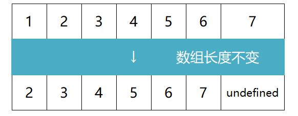

## 数组  
> 虽然在 JavaScript 里，数组可以保存不用类型的值，但我们还是遵守最佳实践，避免这么做。  

### 创建和初始化数组  
> 这里只介绍最好的方式。

**创建数组**  
```
let X = [];
```  
**创建并初始化数组**  
```
let x = ['a','s','d']
```  
**查询数组元素数量**  
```
console.log(x.length);
```  

### 访问元素和迭代数组  
**访问元素**  
```
console.log(x[N]);
```  
**迭代数组**  
```
for(let i =0;i<x.length;i++){
  console.log(x[N]);
}
```  
#### 斐波那契数列
> 斐波那契数列中的前两项是 1，从第三项开始，每一项都等于前两项之和。  
>
> 此处求斐波那契数列的前 20 个数。（实际上只有的19个数？）  
```
const x =[];
x[1] = 1;
x[2] = 2;

for(i=3;i<20;i++){
 x[i] = x[i-1] + x[i-2];
}

console.log(x);         // 也可以替代为迭代数组
```  

### 添加元素  

**在数组末尾添加元素**  
```
x[x.length] = 'f';
```  
或者  
```
x.push('f','g');
```  
**在数组开头插入元素**  
```
x.unshift('q','w');
```
或者  
```
Array.prototype.insertFirstPosition = function(value){      // in...为函数（方法）取的名字
  for (let i = this.length; i>0; i--){
    this[i] = this[i-1];
   }
   this[0] = value;
  };
  x.insertFirstPosition('w');
```  
> 此处使数组长度+1，然后把所有元素向后（右）移一位，最后插入首位元素。
> 
> 将此方法直接添加在 Array 的原型上，使所有数组的实例都可以访问到该方法。 

### 删除元素  
**从数组末尾删除元素**
```
x.pop();      // 将删除数组里最靠后的元素
```  
**从数组开头删除元素**  
```
x.shift;      // 将删除数组的第一个元素，且数组长度变化
```
或者  
> 仅用作示例，真实项目中不应该这样使用。  
```  
let x =[1,2,3,4,5,6,7,8];

// （向后）逐个推入数组（undefined 除外）
Array.prototype.a = function(c1){             // a一般表示为 reIndex
	const d = [];
    for (let i = 0; i < c1.length; i++){
    	if(c1[i] !== undefined){
        	console.log(c1[i]);
        	d.push(c1[i]);
        }
    }
    return d;
}

// 手动移除第一个元素并重新排序[①]
Array.prototype.b = function(){               // b一般表示为 removeFirstPosition
	for (let i = 0; i < this.length; i++){
    	this[i] = this[i + 1];
    }
    return this.a(this);                      // 这里的 this 将替代为 处理后的数组实例
}

x.b();
```  
> 操作①的原理图如下：  
>   

### 在任意位置添加或删除元素  
> splice()方法，既可以添加元素，也可以删除元素。
> 
> 参数1：索引值 参数2：删除元素( 包括索引值指向的元素 )的数量 参数3+：添加到数组里的值。
```
let x = [1,2,3,4,5,6,7,8];
let y = x.splice(2,2);       // 1,2,5,6,7,8
let z = x.splice(2,0,3,4);   // 1,2,3,4,5,6,7,8
```  

## 二维和多维数组  
> JavaScript 只支持一维数组，并不支持**矩阵**（二维数组，或**数组的数组**），但我们可以用数组套用数组来实现矩阵。

```
let x = [];
x[0] = [1,2,3];
x[1] = [4,5,6];
```  


**迭代二位数组的元素**  
在浏览器控制台中打印二维数组  
```
console.log(x);
console.table(x);   // 据说这条会显示一个更加友好的输出结果，测试失败
```
或
```
function printMatrix(c1){
	for (let i = 0; i < c1.length; i++){
		for(let j = 0; j < c1[i].length; j++){
        	console.log(c1[i][j]);      // 没有设置返回值
    }
  }
}
printMatrix（x）;
```  
**三维数组**  
> 创建一个3\*3\*3的矩阵，每一格里包含矩阵的i（行）、j（列）、及z（深度）**之和**。  
> ``` 
> const x =[];
> for (let i = 0; i<3; i++){
>  x[i] = [];
>   for (let j = 0; j < 3; j++){
>    x[i][j] = [];
>     for (let z = 0; z < 3; z++){
>      x[i][j][z] = i + j + z;    //赋值
>     }
>   }
> }
> ```
**迭代三维数组的元素**  
```
function a(c1){                                  
 for (let i = 0; i < c1.length; i++){            // 通常命名为 matrix3x3x3  
   for(let j = 0; j < c1[i].length; j++){  
      for(let z = 0; z < c1[i][j].length; z++){   // 多一个维度  
        console.log(c1[i][j][z]);      
      }
    }
  }
}
a（x）;
```  

## JavaScript 的数组方法参考  
**数组合并**  
> `concat（）`方法可以向一个数组传递数组、对象或是元素。（均会被当成一个元素）  
```
const x =[1,2];
const y ={name:'a',age:'b'};
const z = 3;
let zz = x.concat(y,z);     // [1,2,{name:'a',age:'b'},3]
```  
**迭代器函数**  
> 设定一个数组，如果数组里的元素可以被 2 整除（偶数），函数就返回 true，否则返回 false。
```
const isEven = a => a % 2 === 0;    // isEven是自己取的函数名; 后面的表达式会返回布尔值
let x =[1,2,3,4,5,6,7];
```  
**用 every（） 迭代**  
> 对数组中的每个元素运行**给定函数**（指参数），如果该函数对每个元素**都返回 true**，则返回 true。
>  
> 本例中，数组的第一个元素是 1，因此 isEven 函数返回 false，然后 every 执行结束。  
```
x.every(isEven);
```  

**用 some() 迭代**  
> 对数组中的每个元素运行给定函数，如果任一元素返回 true，则返回 true.  
```
x.some(isEven);
```  

**用 forEach() 迭代**  
> 对数组中的每个元素运行给定函数，无返回值。  
> 
> 使用结果与 for 循环相同。  
```
x.forEach(a => console.log(a % 2 === 0));
```

**用 map() 取回新数组**  
> 对数组中的每个元素运行给定函数，返回每次**函数调用的结果**组成的数组。  
```
x.map(isEven);
```

**用 filter() 取回新数组**  
> 对数组中的每个元素运行给定函数，返回该函数会**返回 true 的元素**组成的数组。  
```
x.filter(isEven);
```

**解析 reduce() 的用法**  
> 语法  
> ```  
> arr.reduce(callback,[initialValue])
>   
> 解释： 
> call back (取回执行数组中每个元素的函数所包含的四个参数)
>   1.previousValue （上一次调用回调返回的值，或初始值）
>   2.currentValue  （数组中当前被处理的元素）
>   3.index         （当前元素在数值中的索引）// 可选
>   4.array          (调用 reduce 的数组)    // 可选
> initialValue       (设置的初始值）          // 可选  
> ```  
对数组的所有元素求和  
```
let x = [2,3,4];
x.reduce((a,b) => a + b);       // 结果为 9，将调用函数 2 次
x.reduce(((a,b) => a * b),2);   // 结果为 48，将调用函数 3 次，有初始值可以避免空数组报错
```  
有篇写的很好的文章，可以学习[更高级的技巧](https://www.jianshu.com/p/e375ba1cfc47)。  

