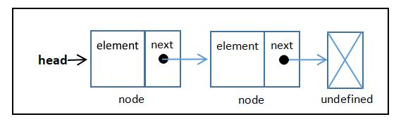

# 链表  
> 链表存储有序的元素集合，但不同于数组，链表中的元素在内存中并不是连续放置的。每个元素由一个存储元素本身的节点和一个指向下一个元素的引用（也称指针或链接）组成。  
> 
> 添加或移动元素时，不需要移动其他元素。  
> 想要访问某个元素，需要从起点（表头）开始迭代链表直到找到所需的元素。

图解：  
> **head** 引用首个 node；而每个 node.next 又引用下一个 node；最后的 node.next 引用 undefined。  
  

## 创建链表  
a.骨架  
```
class LinkedList {
    constructor(equalsFn = defaultEquals) {
        this.count = 0;
        this.head = undefined;
       this.equalsFn = equalsFn;
    }
}  
``` 
b.助手类和方法  
```
class Node {
    constructor(element) {
        this.element = element;
        this.next = undefined;
    }
}

function defaultEquals(a,b) {
        return a === b;
}
```  
**向链表尾部添加元素**  
```
push(element) {
    const node = new Node(element);
    let current;
    if (this.head == null) {  // 链表为空
        this.head = node;
    } else {                  // 链表不为空
        current = this.head;
        while (current.next != null) {
            current = current.next;
        }
        current.next = node;
    }
    this.count++;
}
```  
> this.head == null 和（this.head ===undefined || head === null）等价。  
> current.next != null 和 (current.next !== undefined && current.next !== null) 等价。  
**从链表中移除元素**  
```
removeAt(index) {
    // 检查越界值
    if (index >= 0 && index < this.count) {
        let current = this.head;
          
        if (index === 0) {     // 移除第一项
            this.head = current.next;  
        } else {
            let previous;
            for (let i = 0; i < index; i++) {
                previous = current;      // 赋值为移除项前一项
                current = current.next;  // 赋值为移除项
            }
            previous.next = current.next; // 使 previous 链接到原下一项(移除项)的下一项。
        }
        this.count--;
        return current.element;
    }
    return undefined; // 当值越界时
}
```

