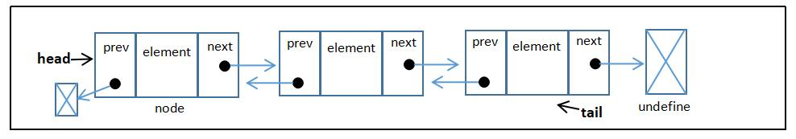

# 链表  
> 链表存储有序的元素集合，但不同于数组，链表中的元素在内存中并不是连续放置的。每个元素由一个存储元素本身的节点和一个指向下一个元素的引用（也称指针或链接）组成。  
> 
> 添加或移动元素时，不需要移动其他元素。  
> 想要访问某个元素，需要从起点（表头）开始迭代链表直到找到所需的元素。

图解：  
> **head** 引用首个 node；而每个 node.next 又引用下一个 node；最后的 node.next 引用 undefined。  
  

## 创建链表  
a.骨架  
```
class LinkedList {
    constructor(equalsFn = defaultEquals) {
        this.count = 0;
        this.head = undefined;
       this.equalsFn = equalsFn;
    }
}  
``` 
b.助手类和方法  
```
class Node {
    constructor(element) {
        this.element = element;
        this.next = undefined;
    }
}

function defaultEquals(a,b) {
        return a === b;
}
```  
**向链表尾部添加元素**  
```
push(element) {
    const node = new Node(element);
    let current;
    if (this.head == null) {  // 链表为空
        this.head = node;
    } else {                  // 链表不为空
        current = this.head;
        while (current.next != null) {
            current = current.next;
        }
        current.next = node;
    }
    this.count++;
}
```  
> this.head == null 和（this.head ===undefined || head === null）等价。  
> current.next != null 和 (current.next !== undefined && current.next !== null) 等价。  

**从链表中移除元素**  
```
removeAt(index) {
    // 检查越界值
    if (index >= 0 && index < this.count) {
        let current = this.head;
          
        if (index === 0) {     // 移除第一项
            this.head = current.next;  
        } else {
            let previous;
            for (let i = 0; i < index; i++) {
                previous = current;      // 赋值为移除项前一项
                current = current.next;  // 赋值为移除项
            }
            previous.next = current.next; // 使 previous 链接到原下一项(移除项)的下一项。
        }
        this.count--;
        return current.element;
    }
    return undefined; // 当值越界时
}
```  
**循环迭代链表直到目标位置**  
> `node != null` ：为了确保不会发生运行时的错误。
```
getElementAt(index) {
    if (index >= 0 && index < this.count) {
        let node = this.head;
        for(let i = 0; i < index && node != null; i++) {
            node = node.next;
        }
        return node;
    }
    return undefined;
}
```  
**在任意位置插入元素**  
```
insert(element,index) {
    if (index >= 0 && index <= this.count) {
        const node = new Node(element);
        if (index === 0) {    // 添加到首位
            const current = this.head;
            node.next = current;
            this.head = node;
        } else {
            const previous = this.getElementAt(index - 1);  // 需要添加新节点的前一个位置
            const current = previous.next;
            node.next = current;
            previous.next = node;
        }
        this.count++;
        return true;
    }
    return false;
}
```  
**返回一个元素的位置**  
```
indexOf(element) {
    let current = this.head;
    for (let i = 0; i < this.count && current != null; i++) {
        if (this.equalsFn(element,current.element)) {
            return i;    // 直至满足条件
        }
        current = current.next;
    }
    return -1;
}
```  
**利用查找元素位置的方法移除指定元素**  
```
remove(element) {
    const index = this.indexOf(element);
    return this.removeAt(index);
}
```  
**查看链表大小**  
```
size() {
    return this.count;
}
```
**查看链表是否为空**  
```
isEmpty() {
    return this.count === 0;  // return this.size() === 0;
}
```  
**获取链表的首位元素(Node)**  
```
getHead() {
    return this.head;
}
```  
**toString 方法**  
> 改变了默认方法，此时输出链表变量，将输出字符串而非\[object]。  
```
toString() {
    if (this.head == null) {
        return '';
    }
    let objString = `${this.head.element}`;
    let current = this.head.next;
    for(let i = 1; i < this.size() && current != null; i++) {
        objString = `${objString},${current.element}`;
        current = current.next;
    }
    return objString;
}
```
## 双向链表  
> 在双向链表中，链接是双向的。

图解：  
> 头部和尾部的处理稍有不同： undefined 不会指向头尾。  
  

**创建双向链表————继承**    
```
class DoublyLinkedList extends LinkedList {
    constructor(equalsFn = defaultEquals) {
        super(equalsFn);
        this.tail = undefined;
    }  // 添加的方法
}
// 双向链表的节点
class DoublyNode extends Node {
    constructor(element, next, prev) {
        super(element, next);
        this.prev = prev;
    }
}
```  
**在任意位置插入新元素**  
> 向（空/非空）链表头部、向最后、向中间插入一个元素。
```
insert(element, index) {
    if (index >= 0 && index <= this.count) {
        const node = new DoublyNode(element);
        let current = this.head;
        if (index === 0) {
            if (this.head == null) {
                this.head = node;
                this.tail = node;
            } else {
                node.next = this.head;
                current.prev = node;
                this.head = node;
            }
        } else if (index === this.count) {
            current = this.tail;
            current.next = node;
            node.prev = current;
            this.tail = node;
        } else {
            const previous = this.getElementAt(index - 1);
            current = previous.next;
            node.next = current;
            previous.next = node;
            current.prev = node;
            node.prev = previous;  // 后面四步即建立链接
        }
        this.count++;
        return true;
    }
    return false;
}
```

**从任意位置移除元素**  
> 从头部（总共一项，非仅一项）、从尾部、从中间移除一个元素。  
```
removeAt(index) {
    if (index >= 0 && index < this.count) {
        let current = this.head;
        if (index === 0) {
            this.head = current.next;
            if (this.count === 1) {
                this.tail = undefined;
            } else {
                this.head.prev = undefined;
            }
        } else if (index === this.count - 1) {
            current = this.tail;
            this.tail = current.prev;
            this.tail.next = undefined;
        } else {
            current = this.getElementAt(index);
            const previous = current.prev;
            previous.next = current.next;
            current.next.prev = previous;
        }
        this.count--;
        return current.element;
    }
    return undefined;
}
```  
其他方法，如 push()，也需改动。


